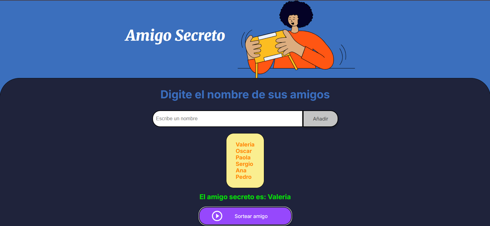

# **Proyecto: Página MUSICVIBES Selección de Artistas** 

Este proyecto hace referencia al challenge del amigo secreto realizado en **programa ONE**.
Es una aplicación que permita a los usuarios ingresar nombres de amigos en una lista para luego realizar un sorteo aleatorio y determinar quién es el **"amigo secreto"**.

##  Descripción del Proyecto

El usuario deberá agregar nombres mediante un campo de texto y un botón "Adicionar". Los nombres ingresados se mostrarán en una lista visible en la página, y al finalizar, un botón "Sortear Amigo" seleccionará uno de los nombres de forma aleatoria, mostrando el resultado en pantalla.

### Vista previa


## ✅ Requisitos del Proyecto

- [x] **Agregar nombres**: Los usuarios escribirán el nombre de un amigo en un campo de texto y lo agregarán a una lista visible al hacer clic en *"Adicionar"*.
- [x] **Validar entrada**: Si el campo de texto está vacío, el programa mostrará una alerta pidiendo un nombre válido.
- [x] **Visualizar la lista**: Los nombres ingresados aparecerán en una lista debajo del campo de entrada
- [x] **Sorteo aleatorio**: Al hacer clic en el botón *"Sortear Amigo"*, se seleccionará aleatoriamente un nombre de la lista y se mostrará en la página.

## Requisitos Técnicos

- [x] **Control de Versiones**: El proyecto está siendo gestionado con Git para el control de versiones.
- [x] **Repositorio en GitHub**: El código fuente del proyecto se encuentra en un repositorio de GitHub.
- [x] **GitHub Pages**: La página está publicada utilizando GitHub Pages y es accesible de manera pública a través de un enlace directo.

## Enlace al Repositorio

Puedes acceder al código fuente del proyecto en el siguiente enlace de GitHub:  
[Repositorio en GitHub](https://github.com/Valeriagalaviz/AmigoSecreto.git)

## Enlace al Proyecto en Línea

Puedes ver la página en línea en la siguiente URL:  
[Proyecto en GitHub Pages](https://valeriagalaviz.github.io/AmigoSecreto/)

## Estructura del Proyecto

* **index.html**: Contiene la estructura principal de la página, incluyendo un formulario para ingresar nombres de amigos y botones para agregar-relizar sorteo.
* **styles.css**: Archivo de estilos que define la apariencia y el diseño responsivo del sitio.
* **app.js**: Contiene la lógica de la aplicación, incluyendo las funciones para:
	+ Agregar nombres de amigos a una lista
	+ Realizar un sorteo aleatorio para determinar quién es el "amigo secreto"
	+ Mostrar la lista de amigos y el resultado del sorteo
* **README.md**: Archivo de texto que contiene información sobre el proyecto, incluyendo la descripción, requisitos y enlaces al repositorio y al proyecto en línea.

### Creado con:
- HTML
- CSS
- JS

<a href="https://www.w3schools.com/css/" target="_blank">  </a>

<a href="https://www.w3.org/html/" target="_blank">  </a>

<a href="https://developer.mozilla.org/en-US/docs/Web/JavaScript" target="_blank">  </a>
 

## Instalación y uso:

1. **Clonar el repositorio:**
```sh
git clone https://github.com/Valeriagalaviz/AmigoSecreto.git
```
2. **Abrir el proyecto:** 
Accede a la carpeta del proyecto
```sh
cd AmigoSecreto-main
```
3. **Abre el archivo index.html en tu navegador:**
En Windows: Haz doble clic en el archivo index.html.

4. **Visualización en línea:** 
Puedes ver el proyecto en línea en el siguiente enlace: - [Ver el Proyecto](https://valeriagalaviz.github.io/AmigoSecreto/)

## Créditos

Desarrollado por Valeria Galaviz como parte de mi aprendizaje en el desarrollo web.

## Contacto
Para cualquier pregunta o comentario, puedes contactarme a través de los siguientes medios: 
- **GitHub**: [Valeriagalaviz](https://github.com/Valeriagalaviz) 
